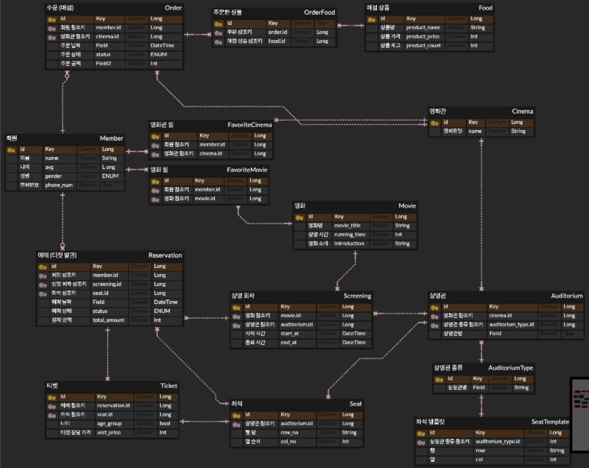

# 2주차

## ERD



## 기능 구현

- 영화관 조회
- 영화 조회
- 영화 예매/취소

## @Entity

**회원**:

**예매**:

**영화관**:

**영화**:

**매점**:

+FK, 연관관계 매핑

FK: 외래 키

+연관관계

- 다대일(N:1)
- 일대다(1:N)
- 일대일(1:1)
- 다대다(N:N)

+연관관계 주인 → FK 관리하는 쪽

+값타입(Value Type)

- 임베디드 타입

+공통

- name
- price
- stockQuantity

+ENUM 타입

→ 속성으로 꼭 (EnumType.STRING) 주자! 기본값 (ORDINARY) → 숫자로 매핑됨

+cascade 속성

? 하이버네이트가 엔티티 영속화할 때.. 컬렉션 → 내장 컬렉션 만듦

컬렉션 넣어둔 다음에 persist 날릴 때

(cascade = CascadeType.ALL) 속성 달아두면

persist(필드명) → 하나로 컬렉션 다 persist 처리 할 수 있음

+Lombok(롬복)

생성자 → 어노테이션 관리

@Getter @Setter

읽기 메서드 제공 /

### +어노테이션

- 기본
    - @Id  → PK
        - @GeneratedValue
- 컬럼명 지정
    - @Column(name = “  “) → PK 테이블 컬럼명 지정
    - @JoinColumn(name = “ “) → FK 테이블 컬럼명 지정 (연관관계 주인 쪽에)
- 연관관계 매핑
    - @ManyToOne → 다대일
    - @OneToMany → 일대다

    - 연관관계 상하관계 표시: mappedBy = ‘field’) 속성으로 주인 지정 (field)

      → 주인이 아닌 쪽은 읽기만 가능

    - 지연 로딩 (fetch = FetchType.LAZY) 어노테이션에 달아주기
- 임베디드 타입
    - @Embeddable → 값 타입 정의하는 곳에 표시
    - @Embedded → 값 타입 사용하는 곳에 표시

## JPARepository

- 영속성 컨텍스트 → 1차 캐시

- 멀티 스레드

## Domain - Repository 설계

### 1. 회원 도메인

Member

MemberService

⬆️

MemberServiceImpl ➡️ MemberRepository

                                              ⬆️

H2MemberRepository / JPAMemberRepository

### 2. 조회 도메인

Cinema / Auditorium

Movie

### 3. 예매/취소 도메인

                                                                              회원 저장소 역할

                                                                                           |  회원 조회

클라이언트 ————————→ 예매 서비스 역할 ———————

                                                                                           | 가격 정책

                                                                            가격 정책 역할 + 할인…?

ReservaitonService

⬆️                                   ⬆️  ➡️  MemberRepository

⬆️                                   ⬆️                   ⬆️

⬆️                                   ⬆️       JpaMemberRepository

ReservaitonServiceImpl ➡️  ➡️  ➡️ 

                                                     ⬇️

⬇️ ➡️ CountPolicy

⬆️

TicketCountPolicy

CountPolicy → 가격 정책

- 영화관 종류 (특별관 / 일반관)
- 매수 (선택좌석수)
- 연령 (어른/어린이)

- 연관관계 주인 (Member- Reservation) : Reservation

  -예매 리스트 조회 서비스 EX)


```java
@Service
@RequiredArgsConstructor
public class ReservationQueryService {
  private final ReservationRepository reservationRepository;

  public Page<ReservationDto> getMemberReservations(Long memberId, int page, int size) {
    var pageable = PageRequest.of(page, size, Sort.by("reservedAt").descending());
    return reservationRepository.findByMemberId(memberId, pageable)
            .map(ReservationDto::from);
  }
}
```

DTO

정적 팩토리 메서드를 사용해서 DTO 사용

## Integration / Unit Test

Global Exception를 만들어봐요

[https://adjh54.tistory.com/79](https://adjh54.tistory.com/79)

Swagger 연동 후 Controller 통합 테스트

Service 계층의 단위 테스트